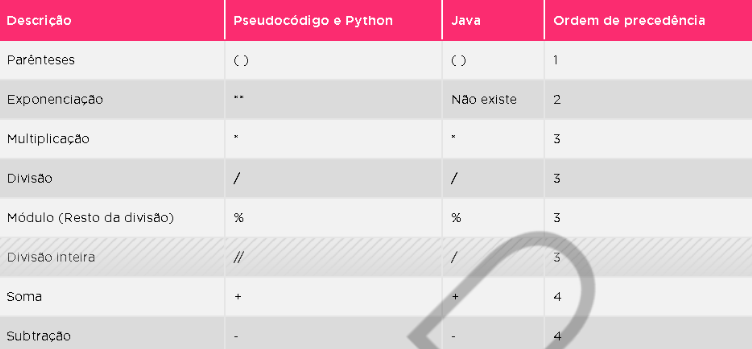
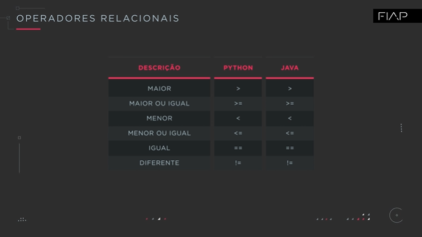
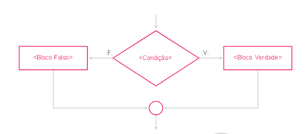
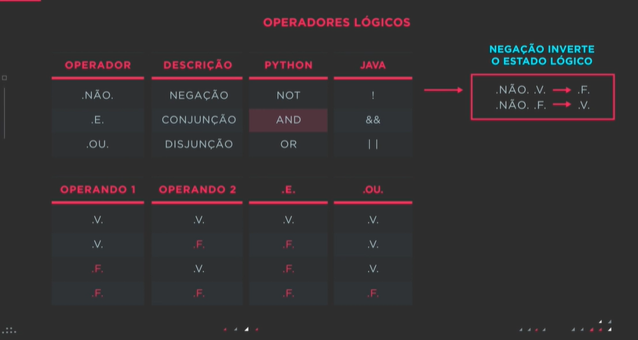
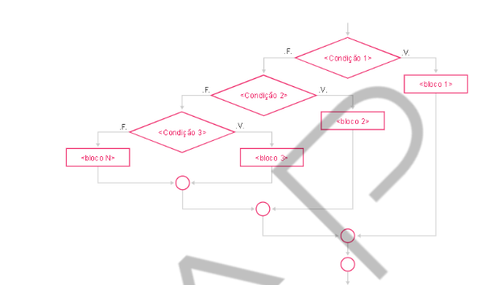
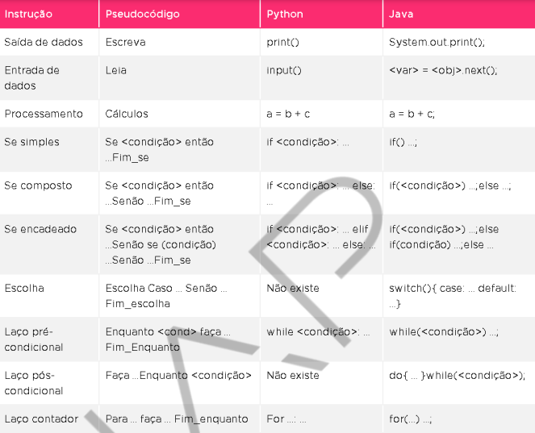

# Nivelamento: Lógica de Programação
FIAP

<a href="#cap01">Capítulo 1: Introdução</a> | 
<a href="#cap02">Capítulo 2: Entrada e Saída de Dados</a> | 
<a href="#cap03">Capítulo 3: Desvios Condicionais</a> | 
<a href="#cap04">Capítulo 4: Laços de repetição</a> | 
<a href="#cap05">Capítulo 5: Funções, procedimentos, vetores e matrizes</a> | 
<a href="#cap06">Capítulo 6: </a>

<h2>📚 Capítulo 1: Introdução</h2>

### 1. “Tecnologia":
- “tekhene”, que significa “Técnica, arteeofício” + “logia”, que significa “estudo”.
- não   devemos   entender   tecnologia   como   algo   informatizado   ou eletrônico,  mas  sim  um  processo  que  visa  melhorar  e  agilizar  tarefaspara  o  ser humano. 

> Os programas de computadores nada mais são que algoritmos que podem ser escritos numa linguagem específica e funcionarem um computador.

### 2. Como o computador entende um programa?

As linguagens  de  programação  são  linguagens  usadas  para  a  comunicação com  o  computador.  São  constituídas  de  comandos,  que  quando utilizados corretamente, executam ações. 

As instruções colocadas em um programa são compiladas (ou interpretados) por  uma  linguagem  de  programação, gerando  um  arquivo  objeto  (linguagem  de montagem).  O  linkeditor  pega  este  arquivo  objeto  e  transforma  em  um  arquivo  em linguagem de máquina (executável: 0 e 1), então o computador consegue interpretar e executar o programa.

A arquitetura  do  computador  é  lógica, representada  por  dois estados  opostos  como ‘sim’ ou ‘não’, ‘verdadeiro’ ou ‘falso’, ‘0’ ou  1.  O ‘0’ e ‘1’ são notações do computador que representam ‘não  passa  corrente’ e ‘passa  corrente’, respectivamente. Um  programa  deve  respeitar  este  conceito  para  que  as  suas instruções sejam convertidas para uma linguagem de programação até a linguagem de máquina, para que sejam compreendidas pelo computador.

### 3. O que é um Algoritmo?

Algoritmo é o processo pelo qual todo problema é submetido, objetivando (por meio de passos que respeitam uma ordem lógica) resolver um problema. É a especificação dos passos em ordem lógica, que visa resolver o problema proposto. Sem um problema não é possível desenvolver um algoritmo.

Ou seja, é uma sequência de passos em ordem lógica que objetiva mostrar como resolvemos um problema!

Os passos sugeridos são colocados numa ordem lógica. Para que o algoritmo funcione adequadamente, partimos do princípio de queo passo anterior obteve êxito, caso contrário há uma falha **(bug)** no algoritmo!

**Importante:** em um algoritmo nunca colocamos valores (quem os digita é o usuário), apenas elencamos os passos necessários!!

### 4. Pseudocódigo e Fluxograma:

O algoritmo tem formas diferentes de representação:
- descrição  narrativa  (ou  narrativa);
- fluxograma  (ou  diagrama  de blocos);
- escrito em uma linguagem de programação escolhida.

O  objetivo  destas  formas  diferentes  de  representação  é  para facilitar  o  aprendizado  na  construção  do  algoritmo,  depois,  uma  ou  outra  destas formas de representação poderão servir como documentação do sistema!

A) Pseudocódigo:

- normalmente em português para um melhor entendimento.
- regras, sintaxes ecritérios empregados são similares aos das linguagens de programação  reais.
- tem o objetivo de aprimorar a disciplina e a organização que uma linguagem de programação exige do aprendiz de programação. 
- o fato de a linguagem ser em português facilita o aprendizado do algoritmo, forçando o aprendiz a adquirir a disciplina necessária para aprenderuma linguagem de programação real.
- tem um corpo que é dividido em três partes:
  - Nome do programa: Local onde colocamos o nome que daremos ao algoritmo.
  - Ambiente de declaração de variáveis: Local onde declararemos as variáveis com os seus nomes e tipos.
  - Corpo do algoritmo: Local onde escreveremos as instruções do algoritmo.

B) Fluxograma:
-  consiste na imagem (visão macro) do algoritmo, enquanto o pseudocódigo (ou o código-fonte aplicado em uma linguagem de programação)é o detalhamento de como foi desenvolvido o algoritmo.
- seu objetivo é o de desenhar a ideia do algoritmo, mostrando assim o fluxo (sentido) dado entre os processos.
- é a forma de representação gráfica dos passos do algoritmo através de figuras que representam estas ações. Nesta forma de representação do algoritmo usamos regras para cada uma das figuras/instruções.

<h2>📚 Capítulo 2: Entrada e Saída de Dados</h2>

### 1. Introdução:

Para desenvolver um algoritmo, há oito comandos bases na Programação. São eles: 
- Entrada de dados: Leia
- Saída de dados: Escreva
- Processamento de dados
- Decisão:
	- Se então
- Se então senão
- Se encadeado
- Escolha
- Estruturas de repetição:
- Pré-condicional: Enquanto-faça
- Pós-condicional:  Faça-enquanto
- Contador: Para

Cada linguagem de programação trata estes comandos de uma forma diferente, com regras diferentes (em alguns casos até iguais) e sintaxes e verbos diferentes. **E há linguagens de programação que não tem um ou mais destes oito comandos!**

### 2. Exibindo dados para o usuário (SAÍDA DE DADOS)

**Saída de dados:** representa todo momento em que o Algoritmo precisa interagir com o usuário. Ou seja, o programador usa esta instrução toda vez que desejar que o Algoritmo mostre algo para o usuário!
**Importante:** 
-  “Sintaxe” = regras de utilização de uma instrução
- “Termos” :  combinação  de  variáveis,  constantes  ou expressões
- Código-fonte: o arquivo texto onde escrevemos os programas
- Comentário: texto inserido dentro do  código-fonte  que seja  um  auxílio para o entendimento das instruções. O compilador o ignora!!

A) Pseudocódigo:

Sintaxe:
Escreva &lt;expressão&gt;
O termo “expressão” usado no código-fonte se  refere  a  uma  mensagem, variável, cálculo ou qualquer uma destas combinações.

~~~
Exemplos:
Programa
saida_de_dados
Início
// exibe “Meu primeiro programa”
Escreva  “Meu primeiro programa”
// exibe o número 12
Escreva 12
Fim 
~~~

B) Python:

Sintaxe:
print(&lt;expressão&gt;)

Exemplo:
~~~python
# Exibe "Meu primeiro programa"
print("Meu primeiro Programa")
# Exibe o número 12
print(12)
~~~

O Python tem três formas de exibir dados com um print:
- Separando os termos com vírgula (,)
- Utilizando a função format()
- Utilizando o print(f””)

Exemplos:

~~~python
nome = "Monica"
idade = 30
altura = 159 
# Forma 1
print("1. O meu nome é", nome, "tenho", idade, "anos e ", altura, "centímetros de altura")
# Forma 2
print("2. O meu nome é {} tenho {} anos e {} centímetros de altura".format(nome, idade, altura))
print("2. O meu nome é {0} tenho {1} anos e {2} centímetros de altura".format(nome, idade, altura))
print("2. O meu nome é {n} tenho {i} anos e {a} centímetros de altura".format(n=nome, i=idade, a=altura))
# Forma 3
print(f"3. O meu nome é {nome} tenho {idade} anos e {altura} centímetros de altura")
~~~

C) Java:

Sintaxe:
System.out.println(&lt;expressão&gt;);

Exemplos:

~~~java
// Exibe "Meu primeiro programa"
System.out.println("Meu primeiro programa");
// Exibe o número 12
System.out.println(12);
~~~

Em  Java, utiliza-se  a  classe  System  e  o  método  out  para  exibir  informações, objetos de cadeias de caracteres que contenham a implementação de formatação são instâncias de PrintWriter, uma classe de cadeias de caracteres, e PrintStream, uma classe de controle de bytes. Dois níveis de formatação estão disponíveis: 

- print e println formatam valores individuais em um modo padrão
- format formata qualquer valor numérico baseado numa String, quando são necessárias várias opções para uma formatação.

Os métodos print ou println enviam para a saída um simples valor após convertê-lo  usando  um  método  toString  apropriado!

~~~java
public class Equacao {
   public static void main(String[] args) {
      int i = 2;
      double r = Math.sqrt(i);
      System.out.print("A raiz de ");
      System.out.print(i);
      System.out.print(" é ");
      System.out.print(r);
      System.out.println(".");

      i = 5;
      r = Math.sqrt(i);
      System.out.println("A raiz de " + i + " é " + r + "."); 
      }
}
~~~

### 3. Recebendo dados em variáveis (ENTRADA DE DADOS)

Entrada de dados é a instrução que faz a interação do usuário com o Algoritmo (ao contrário da Saída de dados). É complementar à instrução de Saída de dados.

Na saída de dados, usamos a tela do monitor como referência; na entrada de dados, o teclado. Toda vez que o usuário tiver que inserir uma informação no algoritmo, o programador usará um comando de entrada de dados.

  3.1 Variáveis de memória

“Variável” é algo que pode ter o seu conteúdo modificado no decorrer do algoritmo. É uma posição na memória do computador, com um nome e tipo, que  armazena  uma  informação.  Caso  uma  segunda  informação  seja  colocada  na mesma  variável,  o  primeiro  valor  será  sobreposto,  armazenando  assim  o  segundo valor.

  3.2 Nomeando variáveis

Toda  variável  deve  ter  um  nome  próprioe  único no  algoritmo  onde  ela  será utilizada. 
Para definir um nome de variável, há algumas regras gerais:
- não pode ser uma palavra reservada pela linguagem de programação, como print;
- deve começar com letra;
- não podeconter caracteres especiais, exceto underline (_).

Há linguagens de programação com exceções, como poder iniciar o seu nome com o caractere especial underline(_), no caso da linguagem C e suas derivadas, e outras que aceitam cifrão($) e deve iniciar com ele (PHP), etc.

Apesar de não ser uma regra, é uma boa prática colocar nomes de variáveis com rótulos que lembrem a informação que ela armazenará.

  3.3 Atribuindo um tipo às variáveis

Tipo é o formato em que o conteúdo será armazenado. Os tipos clássicos são:

- Caractere: utilizamos este tipo de dado quando precisamos armazenar apenas um caractere (letra, dígito ou caractere especial) em uma  variável. O conteúdo de um dado caractere pode estar entre apóstrofo (‘) ou aspas (“).

- Texto: utilizamos este tipo de dado quando precisamos armazenar uma cadeia de caracteres como conteúdo  de uma variável. Como o tipo caractere, seu conteúdo pode estar entre aspas ou apóstrofo.

- Inteiro: está na classificação dos numéricos. Os dados numéricos são aqueles que permitem que seja efetuado calculo com o seu conteúdo. Utilizamos este tipo de dado quando precisamos armazenar informações numéricas que não tenham casas decimais. O conteúdo de uma variável numérica, seja inteiro ou real, colocamos apenas o número, sem a necessidade de caractere complementar!!

- Real: também está na classificação dos numéricos. Utilizamos este tipo de dado toda vez que precisamos  armazenar valores que podem conter casas decimais(valores fracionários). Pela linguagem de programação  ser de língua inglesa, o separador de casas decimais é o ponto (e não a vírgula)!

- Lógico: quando precisamos armazenar informações lógicas - informações cujo conteúdo pode ser representado por Verdade (True) ou Falso (False).

  A) Pseudocódigo:

Sintaxe: Leia &lt;variável&gt;

~~~
Programa entrada_de_dados_e_variaveis
Var
 Salario: real
Inicio  
 // Solicita o salário ao usuário
 Escreva “Digite o seu salário:”
 Leia salario
 // exibe o salário digitado
 Escreva “Salário = R$”, salario
Fim
~~~

  B) Python:

Sintaxe: &lt;variável&gt; = input([&lt;Mensagem&gt;])
A mensagem dentro do input é opcional!

~~~python
# Pede a digitação do salário ao usuário
salario = input("Digite o seu salário:")
salario = float(salario)
# Exibe o salário digitado
print("Salário = R$", salario)
~~~

> Em Python não declaramos variáveis com um tipo! Sua Tipagem é dinâmica, ou seja, no decorrer do programa ela pode assumir conteúdos de tipos diferentes. 

Uso do casting:

~~~python
nome = "Edson"      # Tipo Texto (string)
salario = 1234.56   # tipo real (float)
qtd_filhos = 2      # tipo inteiro (int)
opcao = 's'         # tipo caractere
maioridade = True   # tipo lógico

# Utilizando casting para modificar o tipo da variável
x = "55"            # x é do tipo string e vale '55'
x = float(x)        # x passou a ser float e vale 55.0
x = str(x)          # x voltou a ser string
x = int(x)          # x passou a ser int e vale 55
~~~

A variável pode assumir diversos tipos no decorrer do programa. Para  saber  o  tipo  atual  dela,  utilizamos  a **função type()**. 

~~~python
# UTILIZANDO VARIÁVEIS DIFERENTES E DESCOBRINDO OS TIPOS
nome = "Edson"      # Tipo Texto (string)
print(f"A variável nome = {nome}é do tipo {type(nome)}")
salario = 1234.56   # tipo real (float)
print(f"A variável salario = {salario}é do tipo {type(salario)}")
qtd_filhos = 2      # tipo inteiro (int)
print(f"A variável qtd_filhos = {qtd_filhos}é do tipo {type(qtd_filhos)}")
opcao = 's'
print(f"A variável opcao = {opcao}é do tipo {type(opcao)}")
maioridade = True   # tipo lógico
print(f"A variável maioridade = {maioridade}é do tipo {type(maioridade)}\n")

# UTILIZANDO A MESMA VARIÁVEL E DESCOBRINDO O SEU TIPO DEPOIS DE UM CASTING
x = "55"            # x é do tipo string e vale '55'
print(f"x = {x}e é do tipo {type(x)}")
x = int(x)          # x passou a ser int e vale 55
print(f"x = {x}e é do tipo {type(x)}")
x = str(x)          # x voltou a ser string
print(f"x = {x}e é do tipo {type(x)}")
x = float(x)        # x passou a ser float e vale 55.0
print(f"x = {x}e é do tipo {type(x)}")
~~~

  C) Java:

Sintaxe: 

Scanner entrada = new Scanner (System.in);
...
&lt;varInt&gt; = &lt;objeto&gt;.nextInt(); // Lê variável inteira
&lt;varFloat&gt; = &lt;objeto&gt;.nextFloat(); // Lê variável inteira
&lt;varString&gt; = &lt;objeto&gt;.nextLine(); // Lê variável inteira

Exemplo:

~~~java
Scanner entrada = new Scanner(System.in);
// Pede a digitação do salário ao usuário
salario = input("Digite o seu salário:")
System.out.println("Digite o seu salário:");
salario = entrada.nextFloat();
// Exibe o salário digitado
System.out.println("Salário = R$" + salario);
~~~

Em Java utilizamos a classe Scanner para fazer a entrada de dados, a qual permite a leitura do buffer de teclado e guardar o conteúdo lido em uma variável do mesmo tipo definido. Por meio do método next, receberá a digitação de uma String até o pressionar do ENTER.

Outras formas de utilizar o método next para outros tipos de dados:
- float numF = sc.nextFloat(); 
- int num1 = sc.nextInt(); 
- byte byte1 = sc.nextByte(); 
- long lg1 = sc.nextLong(); 
- boolean b1 = sc.nextBoolean(); 
- double num2 = sc.nextDouble(); 
- String nome = sc.nextLine().

### 4. Operações com variáveis numéricas:

5. De-para: pseudocódigo para Java e Python

**Exemplo 1:**

Dados quatro (4) números pelo usuário, fazer um algoritmo que calcule a média simples destes números.

  Pseudocódigo:

~~~
Programa exemplo1
  Var n1, n2, n3, n4, media: real
Início
  // Solicita quatro números ao usuário
    Escreva “Digite 4 números:”
    Leia n1
    Leia n2
    Leia n3
    Leia n4
  // Calcula a média dos 4 números
  Media = (n1 + n2 + n3 + n4) / 4
  // Calcula a média dos 4 números
  Escreva “Média = “, media
Fim
~~~

Observação: no arquivo .py, na  leitura  do  n1, ele  está  recebendo  o  input(),  na  linha  de  baixo  o  n1  é convertido  para  float e  jogado  nele  mesmo.  Nas  próximas  variáveis  estes  dois processos são feitos na mesma linha. O input() pega o dado fornecido pelo usuário e sempre o retorna no tipo string. Caso queira o dado em outro tipo, faça o Casting!

**Exemplo 2:**

Dado o preço do maçode cigarros, a quantidade de maços consumidos por dia e o tempo em anos que a pessoa fuma, calcular quanto esta pessoa já gastou fumando. 

~~~
Programaexemplo2
Var
  preco_maco, qtd_maco, anos, dias_fumante, custo: real
Início  
  // Solicitar os dados ao usuário
  Escreva “Digite o preço do maço:”
  Leia preco_maco
  Escreva “Digite a quantidade de maços:”
  Leia qtd_maco
  Escreva “Digite a qtd. de anos que fuma:”
  Leia anos
  // calcula a qtd. de dias como fumante
  dias_fumante = anos * 365
  // calcula a qtd. de dias como fumante 
  dias_fumante = anos * 365
  // calcula o gasto do tempo que fuma
  custo = dias_fumante * preco_maco
  // Exibe o custo
  Escreva “Você já gastou R$ “, custo, ”Fumando”
Fim
~~~

**Exemplo 3:**

Dada uma quantia (considere que já seja múltiplo de 10), fazer um algoritmo que calcule quantas cédulas de 10, 20 e 50 são necessárias para compor esta quantia.

~~~
Programaexemplo3
Var
  ced10, ced20, ced50: inteiro
Início  
  /*Solicita a quantia*/
  Escreva “Digite a quantia:”
  Leia quantia
  /*Efetua os cálculos das quantias de cédulas */
  ced50 = quantia // 50
  quantia = quantia % 50
  ced20 = quantia // 20
  quantia = quantia % 20
  ced10 = quantia // 10
  quantia = quantia % 10
  /*Exibe as quantidades de cédulas */
  Escreva “Quantidade das cédulas: “
  Escreva “Cédulas de 50 = “, ced50
  Escreva “Cédulas de 50 = “, ced20
  Escreva “Cédulas de 50 = “, ced10
Fim
~~~

<h2>📚 Capítulo 3: Desvios Condicionais</h2>

### 1. Introdução:

Tipos de comandos:

- comandos simples (Primitivos): são sequenciais e ocupam apenas uma linha, ou seja, executam o algoritmo na sequência em que os comandos aparecem.

- comandos estruturados: desviam o fluxo do algoritmo, fazendo com que as instruções não sejam executadas necessariamente na sequência. Todos os comandos estruturados têm um início e fim próprio (como SE e FIM_SE). O  fluxo das instruções a serem seguidas são escolhidas de acordo com o resultado da avaliação das condições!

Há duas classificações da estrutura de desvio condicional: 

- Decisão:
  - Desvio simples: SE ENTÃO
  - Desvio composto: SE ENTÃO SENÃO
  - Desvio encadeado
- Escolha

### 2. Desvio simples:

**Comando  de  decisão  SE ENTÃO:** utilizado para analisar uma condição e executar um determinado &lt;bloco de comandos&gt; caso a condição seja verdadeira, senão nada será executado.

Representação no fluxograma:

> Condição é uma expressão que retorne um valor lógico. Ela funciona como uma pergunta, onde uma resposta lógica  (V ou F) determinará o andamento do fluxo. A condição é uma expressão composta por três partes: variável operador_relacional variável_ou_valor.

Representação:
Observação sobre o &lt;bloco verdade&gt;: é executado caso a condição resulte verdade.

A) Pseudocódigo:

~~~
Sintaxe: 
Se <condição> então
  <bloco verdade>
Fim_se
~~~

B) Python:

~~~python
Sintaxe:
if <condição>:
  <bloco verdade>
~~~

C) Java:

~~~java
Sintaxe:
if (condição)
{
  <bloco verdade>;
}
~~~

**Operadores relacionais:**

**Conceito de bloco:**

loco é um conjunto de instruções (comandos) que é isolado pelo programador dos demais comandos por atender um objetivo em comum.

Cada linguagem de programação tem uma forma diferente de separar e gerenciar os blocos:

- Pseudocódigo: Não há um caractere ou palavra específica para delimitar o bloco. O Pseudocódigo geralmente utiliza o Fim_(nome do comando).

- Python:entende o bloco por meio da identação (neologismo derivado da palavra inglesa identation, que significa  recuo), em outros termos, as instruções sequenciais na mesma coluna estão no mesmo bloco.
  - Identação é uma técnica de edição de código-fonte importante em todas as linguagens de programaçã, por  organizar o código-fonte e tornar mais fácil a identificação de um erro de compilação.

- Java: entende como bloco todas as instruções que estão entre chaves ({bloco}).

**Exemplo:** conceito de decisão simples (SE ENTÃO)

Fazer um algoritmo que solicite um número ao usuário e exiba o seu módulo matemático (obs.: módulo matemático é tornar um número positivo. Se ele for, continua, senão passa a ser).

~~~
Programa exibir_numero_positivo
Var
  n: inteiro
Início  
  // exibe “Solicita um número para o usuário”
  Escreva “Digite um número:”
  Leia n
  // Comando de decisão: Verifica se o número é negativo
  Se n < 0 então
    n = n * -1
  Fim_se
  //Exibeo número positivo
  Escreva “Módulo:”, n
Fim
~~~

### 3. Desvio composto:

O desvio composto tem tanto o &lt;bloco verdadeiro&gt; quanto o &lt;bloco falso&gt;! 

O comando SE ENTÃO SENÃO é utilizado quando o desvio for composto por dois blocos, o verdadeiroe o falso - é uma bifurcação: um de dois caminhos é seguido a partir da resposta de uma condição pré-estabelecida (depois da palavra SE); caso a condição resulte verdade, será executado o &lt;bloco verdade&gt; (que é representado pelo ENTÃO),  caso contrário será executado o &lt;bloco falso&gt; (representado pelo SENÃO).

No fluxograma:

Sintaxes:

A) Pseudocódigo:

~~~
Se <condição> então
  <blocoverdadeiro>
Senão
  <blocofalso>
Fim_se
~~~

B) Python

~~~python
if <condição>:
  <bloco Verdadeiro>
else:
  <bloco Falso>
~~~

C) Java

~~~java
if (condição)
{
  <blocoverdadeiro>;
}
else
{
  <blocofalso>;
}
~~~

**Exemplo:** exemplo de desvio composto (SE ENTÃO SENÃO)

Solicitar ao usuário a sua idade e exibir mensagem “Maior de idade” caso a idade seja maior ou igual a 18 anos ou “Menor de idade” caso contrário.

Pseudocódigo:
~~~
Programa desvio_composto
Var
  idade: inteiro
Início
  // Solicita a idade do usuário
  Escreva “Digite sua idade:”
  Leia idade
  // Desvio composto exibe mensagem “Maior de idade” quando a idade for maior ou igual a 18 anos e “Menor de idade” caso contrário
  Se idade >= 18 então
    Escreva “Maior de idade”
  Senão 
    Escreva “Menor de idade”
  Fim_se
Fim
~~~

### 4. Desvio encadeado:

> Importante: Operadores lógicos

**Desvio encadeado:** É uma sequência de testes de seleção, os quais serão executados ou não de acordo com o resultado das condições e com o encadeamento dos testes.

Um teste de seleção pode ter dois conjuntos de instruções, um para o resultado verdadeiro e outro para o falso, porém esses conjuntos podem conter outros testes de seleção, que por sua vez, também podem conter outros e assim por diante.

Representação:

Ou seja, denominamos SE ENCADEADO em situações em que há um comando de decisão – não importa se é o SE ENTÃO ou SE ENTÃO SENÃO – dentro do outro!!!

Sintaxe:

A) Pseudocódigo:

~~~
Se <condição 1> então 
  <blocode instruções 1>
Senão 
  Se <condição 2>então
    <bloco de instruções 2>
  Senão 
    Se <condicao3> então 
      <bloco de instruções 3>
    Senão
      <bloco de instruções N>
    Fim_se
  Fim_se
Fim_se
~~~

Também podemos escrever da seguinte forma:

~~~
Se <condição 1> então
  <bloco de instruções 1>
Senão Se <condição 2> então 
  <bloco de instruções 2>
Senão Se <condicao3> então 
  <bloco de instruções 3>
Senão
  <bloco de instruções N>
Fim_se
~~~

B) Python:

~~~python
if <condição 1>:
  <bloco de instruções 1>
else:
  if <condição 2>:
    <bloco de instruções 2>
  else: 
    if <condicao3>:
      <bloco de instruções 3>
    else<bloco de instruções N>
~~~

Ou podemos escrever:

~~~python
if <condição 1>:
  <bloco de instruções 1>
elif <condição 2>:
  <bloco de instruções 2>
elif <condicao3>:
  <bloco de instruções 3>
else<bloco de instruções N>
~~~

Em Python, o “elif” abrevia o encadeamento dos else if’s, tornando a sua estrutura mais legível.

C) Java:

~~~java
if (condição1) 
{
  <expressão>;
}
else
{
  if(condicao2)
  {
    <expressão2>;
  }
  else 
  {
    if(condicao3)
    {
      <expressão3>;
    }
    else
    {
      <expressão_n>;
    }
    }
  }
~~~

Ou podemos escrever:

~~~java
if (condição1)
  <expressão>;
else if (condicao2)
  <expressão2>;
else if (condicao3)
  <expressão3>;
else<expressãoN>;
~~~

**Exemplo:** SE ENCADEADO

Solicitar um número ao usuário. A partir do número, exibir o dia da semana correspondente.

Pseudocódigo:
~~~
Programa exemplo1
Var
  n: inteiro
Início  
  // Solicita um número ao usuário
  Escreva “Digite um número:”
  Leia n
  // Compara o n aos valores possíveis
  Se(n==1)então
    Escreva “Domingo “
  Senão se(n==2) então
    Escreva “Segunda-feira“
  Senão se(n==3) então
    Escreva “Terça-feira “
  Senão se(n==4) então
    Escreva “Quarta-feira “
  Senão se(n==5) então
    Escreva “Quinta-feira “
  Senão se(n==6) então
    Escreva “Sexta-feira “
  Senão se(n==7) então
    Escreva “Sábado “
  Senão 
    Escreva “Dia inválido “
  Fim_Se
Fim
~~~

### 5. Escolha:

Similar ao SE ENCADEADO por verificar diversas possibilidades  de  execução. 

- A *desvantagem* é da Escolha só  comparar equivalência (igual a), enquanto o SE ENCADEADO pode utilizar qualquer operador lógico  ou  relacional(>,  <, and...). 
- A *vantagem* é a de fechar apenas uma vez, independente da quantidade de caminhos (no SE, para cada SE há um FIM_SE).

A estrutura de decisão ESCOLHA testa o valor contido em um identificador (que pode ser uma variável ou um cálculo inteiro) colocada entre parênteses, e o compara com valores fornecidos em cada caso.

Fluxograma:

Sintaxe:

A) Pseudocódigo:

~~~
Escolha(<identificador>)
  Caso <valor1>:
    <comandos 1>
  Caso <valor2>:
    <comandos2>
  Caso <valor3>:
    <comandos3>
  Caso <valor4>:
    <comandos4>
  Outrocaso:
    <outros comandos>
Fim_Escolha
~~~

B) Python:

**EM PYTHON NÃO EXISTE A ESTRUTURA “ESCOLHA” , MAS PODE SER SIMULADA COM O SE ENCADEADO (IF ELIF) QUE UTILIZE  APENAS EQUIVALENCIA (==) COMO OPERADOR.**

C) Java:

~~~java
switch (<identificador>)
{
  case <valor1>:
    <comandos 1>;
    [break;]
  case <valor1>:
    <comandos 1>;
    [break;]
  case <valor1>:
    <comandos 1>;
    [break;]
  case <valor1>:
    <comandos 1>;
    [break;]
  default:
    <comandos default>
}
~~~

Em Java, o comando break força a saída da estrutura. Caso o break não seja colocado, assim que o fluxo entrar em um case, todos as linhas subsequentes serão executadas até o final da estrutura.

**Exemplo:** ESCOLHA

Solicitar um número ao usuário. A partir do número, exibir o dia da semana correspondente.

Pseudocódigo:
~~~
Programa exemplo_escolha
Var
  n: inteiro
Início
  // Solicita um número ao usuário
  Escreva “Digite umnúmero:”
  Leia n
  // Compara o n aos valores possíveis
  Escolha(n)
    Caso 1:
      Escreva “Domingo”
    Caso 2:
      Escreva “Segunda-feira”
    Caso 3:
      Escreva “Terça=feira”
    Caso 4:
      Escreva “Quarta-feira”
    Caso 5:
      Escreva “Quinta-feira”
    Caso 6:
      Escreva “Sexta-feira”
    Caso 7:
      Escreva “Sábado”
    Outrocaso:
    Escreva “Dia inválido”
  Fim_Escolha
Fim
~~~

### 6. Exercícios:

1) Calculadora:

Dados dois números inteiros e uma operação aritmética desejada, calcule a resposta adequada: Utilize os símbolos a seguir para ler qual a operação escolhida:+ soma, -subtração, * multiplicação, / divisão.

Pseudocódigo
~~~
Programa operacao_aritmetica
Var
  numero1, numero2, resultado: real
  operador: caractere
Início  
  // Solicitar os dados ao usuário
  Escreva “Digite o primeiro número:”
  Leia numero1
  Escreva “Digite o segundo número:”
  Leia numero2
  Escreva “Digite a operação desejada (+ -* /):”
  Leia operador
  // Verifica a operação desejada
  Escolha (operador)
    caso ‘+’:
      resultado = numero1 + numero2
      Escreva “Soma = “, resultado
    caso ‘-’:
      resultado = numero1 -numero2
      Escreva “Subtração = “, resultado
    caso ‘*’:
      resultado = numero1 * numero2
      Escreva “Multiplicação = “, resultado
    caso ‘/’:
      Se numero2 == 0 então
        Escreva “Não há divisão por zero”
      Senão
        resultado = numero1 / numero2
        Escreva “Divisão = “, resultado
      Fim_se
    caso contrário:
      Escreva “Operador inválido” 
  Fim_Escolha
Fim
~~~

2) Rodízio:

Dada a parte numérica da placa de um automóvel, fazer um algoritmo que exiba o dia do rodízio.
Considere a regra de São Paulo. Para veículos com final da placa:
- 1 e 2: rodízio é segunda-feira;
- 3 e 4: terça-feira;
- 5 e 6: quarta-feira;
- 7 e 8: quinta-feira;
- 9 e 0: sexta-feira.

Pseudocódigo:

~~~
Programa exemplo2
Var
  numeroPlaca, finalPlaca: inteiro
Início  
  /*Solicita a placa do veículo*/
  Escreva “Digite o número da placa do veículo:”
  Leia numeroPlaca
  /*Efetua o cálculo para saber o último número*/
  finalPlaca = numeroPlaca % 10
  /*Verifica o final da placa com o comando Escolha e exibe o dia da semana do rodízio*/
  Escolha (finalPlaca)
    caso 1:
    caso 2:
      Escreva “Segunda-feira“
    caso 3:
    caso 4:
      Escreva “Terça-feira“
    caso 5:
    caso 6:
      Escreva “Quarta-feira“
    caso 7:
    caso 8:
      Escreva “Quinta-feira“
    caso 9:
    caso 0:
      Escreva “Sexta-feira”
  Fim_Escolha
Fim
~~~

3) Positivo/Negativo/Nulo

Dado um número pelo usuário, informar se ele é positivo, negativo ou nulo.

Pseudocódigo:

~~~
Programa exemplo
Var
  n: inteiro
Início 
  Escreva “Digite um número: ”
  Leia n
  Se n > 0 então
    Escreva “Positivo”
  Senão
    Se n < 0 então
      Escreva “Negativo”
    Senão
      Escreva “Nulo”
    Fim_se
  Fim_se
Fim
~~~

4) Maior 3 números

Dados três números, exibir o de maior valor.

Pseudocódigo:
~~~
Programa exemplo
Var
  n1, n2, n3, maior: inteiro
Início 
  Escreva “Digite 3 números: ”
  Leia n1
  Leia n2
  Leia n3
  maior = n1
  Se n2 > maior então
    maior = n2
  Fim_se
  Se n3 > maior então
    maior = n3
  Fim_se
  Escreva “Maior número: “, maior
Fim
~~~

<h2>📚 Capítulo 4: Laços de repetição</h2>

**Estruturas de repetição** são comandos conhecidos como Looping  e  Laços - apelido que se dá pelo fato de iniciar e terminar no mesmo ponto, e a sua “volta” envolver o bloco de repetição!

Utilizamos esta instrução toda vez que percebemos que no algoritmo há um trecho de instruções que implicam repetições.

Há 3 tipos de laços:

 - Laços pré-condicional: enquanto-faça;
 - laços pós-condicional: faça-enquanto;
 - laço contador: para.

### 1. Laço Enquanto-Faça

É conhecido como Laço Pré-Condicional: primeiro é analisada uma condição, e depois é executado o Bloco de comandos envolvidos pelo laço, ou seja, que serão repetidos.

É o **laço “0,N”**, no qual pode ocorrer de não executar nenhuma volta (zero) ou várias (N); é o laço que tem a característica de primeiro analisar e depois executar.

***Sintaxe:***

A) Pseudocódigo: 

~~~
Enquanto <condição> faça
  <Bloco de repetição>
Fim_Enquanto
~~~

B) Python:

~~~python
while <condição>: 
  <Bloco de repetição>
~~~

C) Java:

~~~java
while (<condição>)
{
  <Bloco de repetição>;
}
~~~

***Funcionamento:***

- "Enquanto &lt;condição&gt; faça" é o início do laço; caso a condição resulte verdade, o fluxo do algoritmo entra no laço.
- Uma vez dentro do laço, o &lt;Bloco  de  repetição&gt; é executado. Lembre-se que bloco de repetição são os comandos que serão repetidos.
- Ao chegar no Fim_enquanto, ele retorna ao início do laço. Chegando no início, analisa-se novamente a condição e enquanto ela resultar verdade, o laço é executado (&lt;Bloco  de  repetição&gt;)novamente. Quando a condição resultar Falso, o fluxo do algoritmo prossegue depois da linha Fim_enquanto.

***Exemplo:***

Fazer um algoritmo que leia e some diversos números dados pelo usuário. Quando o usuário digitar 0 (zero), finaliza o algoritmo. No final, exibir a soma resultante.

Pseudocódigo:
~~~
Programa exemplo1_enquanto_faça
Var
  num, soma: real
Início
  Escreva “Digite 0 para finalizar”
  /* zera a variável que acumula a soma */
  soma = 0
  /* para entrar no laço a primeira vez */
  num = 1 
  /* início do laço Enquanto-Faça */
  Enquanto num != 0 faça
    /* Bloco de repetição*/
    Escreva “Digite um número: “
    Leia num
    soma = soma + num
  Fim_Enquanto
  /* fluxo depois do final do laço*/
  Escreva “Somatória = “, soma
Fim
~~~

Python:
~~~python
print("Digite 0 para finalizar")

# zera a variável que acumula a soma
soma = 0

# para entrar no laço a primeira vez
num = 1

# início do laço Enquanto-Faça
while num != 0:
# Bloco de repetição
    num = float(input("Digite um número: "))
    soma = soma + num

# fluxo depois do final do laço:
# Exibir o valor da somatória
print("Somatoria = ", soma)
~~~

Java:

~~~java
// Estancia o objeto Teclado para ler variáveis
Scanner teclado = new Scanner(System.in);

// Declaração das variáveis
float salario, num = 1, soma = 0;

System.out.println("Digite 0 para finalizar: ");

while (num != 0) {
    System.out.println("Digite um numero: ");        
    num = teclado.nextFloat();
    soma += num; // equivale à soma = soma + 1
}

// Exibe a somatória
System.out.println("Somatória = " + soma);
~~~

### 2. Laço Faça-Enquanto

É um Laço Pós-condicional (inverso do Enquanto-Faça), no qual primeiro é executado o Bloco de Repetição, e depois é analisada a condição. 

Tem a característica de ser o **laço “1,N”**, ou seja, o laço executa o bloco de repetição ao menos uma (1) vez ou várias(N).

***Sintaxe:***

A) Pseudocódigo:

~~~
Faça 
  <Bloco de repetição>
Enquanto <condição>
~~~

B) Python:

~~~python
Esta estrutura de repetição não existe no Python!
~~~

C) Java:

~~~java
do
{
  <Bloco de repetição>;
} while (<condição>);
~~~

*** Funcionamento: ***

- "faça" é o início do laço. Tudo que estiver a partir desta linha será executado incondicionalmente até chegar ao final do laço, onde há uma condição.
- O &lt;Bloco de repetição&gt; é executado ao menos uma vez.
- Ao chegar no "Enquanto &lt;condição&gt;", ele retorna ao início do laço (na linha faça), caso a condição resulte verdadeiro, executando novamente o &lt;Bloco de repetição&gt;.

***Exemplo:***

Em uma eleição, há três candidatos: 1 – Huguinho; 2 – Zezinho e 3 – Luizinho. Fazer um algoritmo que leia votos dados pelo usuário até que ele digite 0 (zero). Ao finalizar a votação, informar quantos votos cada candidato obteve.

A) Pseudocódigo:
~~~
Programa exemplo1_faça_enquanto
Var
  hug, zez, lui, voto: inteiro
Início
  Escreva “Digite o voto ou 0 para finalizar”
  /* zera as variáveis dos candidatos */
  hug= 0 
  zez = 0
  lui = 0
  /* Exibindo o menu com os candidatos */
  Escreva “1 – Huguinho”
  Escreva “2 – Zezinho”
  Escreva “3 – Luizinho”
  Escreva “0 – Terminar a votação”
  /* início do laço Faça-Enquanto*/
  faça
    /* Bloco de repetição*/
    Escreva “Digite o voto: “
    Leia voto
    Escolha (voto)
      Caso 1
        hug = hug + 1
      Caso 2
        zez = zez + 1
      Caso 3
        lui = lui + 1
      Senão
        Escreva “Voto inválido, digite: 1, 2 ou 3”
    Fim_escolha
  Enquanto voto != 0
  /* Exibe a quantidade de votos de cada candidato*/
  Escreva “1 – Huguinho: ”, hug, ”Votos” 
  Escreva “2 – Zezinho: ”, zez, “Votos”
  Escreva “3 – Luizinho”, lui, “Votos”
Fim
~~~

### 3. Laço Para

Os dois laços anteriores (Enquanto-Faça e Faça-Enquanto) são conhecidos como Laços Condicionais - executam o bloco de repetição dependendo da resposta da condição inserida. Portanto, utilizamos os  laços condicionais em situações quando as voltas são indefinidas, ou seja, o controle das execuções está nas mãos do usuário.

Há outro laço, chamado **“Laço Contador”**, empregado melhor em situações em que o programador sabe de antemão a quantidade de voltas que serão executadas. Ou seja, enquanto os dois primeiros laços são conhecidos por executarem voltas indefinidas, o laço Para é conhecido por ser mais bem utilizado em situações em que o número de voltas é previsto.

***Sintaxe:***

A) Pseudocódigo:

~~~
Para <contador> de <início> até <fim> inc <incremento> faça
  <Bloco de repetição>
Fim_para
~~~

Observação:
- &lt;contador&gt;: variável inteira que armazena qual a volta atual.
- &lt;início&gt;: valor que o contador assumirá quando as voltas se iniciarem.
- &lt;fim&gt;: limite de voltas que o contador assumirá.
- &lt;incremento&gt;: a cada volta, quanto o contador será acrescentado.
- &lt;Bloco de repetição&gt;: rotina que será repetida.

B) Python:

~~~python
for <contador> in range (<início>, <fim>, <incremento>):
  <Bloco de repetição>
~~~

Observação: 
- in range: in é um operador relacional e range é uma função que configura um intervalo. Ambos não são exclusivos do laço for, apenas o complementam.

C) Java:

~~~java
for (<inicialização; <condição>; <incremento>)
{
  <Bloco de repetição>;
}
~~~

***Exemplo***

Dados 10 números pelo usuário, somá-los e, no final, exibir a somatória.

Pseudocódigo:

~~~
Programa exemplo1_para
Var
  soma, i, n: real
Início
  soma = 0
  Escreva “Digite 10 números”
  /* Laço configurado para 10 voltas */
  Para i de 1 até 10 inc 1 faça
    Leia n
    soma  = soma + n
  Fim_para 
  Escreva “Somatória = “, soma
Fim
~~~

### Em resumo...

Quando precisamos de uma condição para executar um laço, escolhemos o Enquanto-Faça ou o Faça-Enquanto; para decidir qual dos dois devemos  utilizar, perguntamos: “Este problema requer ao menos uma volta no laço?”. Se a resposta for Sim, escolhemos o Faça-Enquanto, senão, utilizamos o Enquanto-Faça. Agora, se o número de voltas é previsto na concepção do laço, seja por uma constante, seja por uma variável, utilizamos o laço contador Para.

***Exercício 1:*** Enquanto-Faça

Dado um número pelo usuário, calcular e exibir os dez primeiros múltiplos deste número.

Pseudocódigo:

~~~
Programa exemplo1_enquanto_faça
Var
  num, mult, volta: real
Início
  Escreva “Digite um número”
  Leia num
  /* início da contagem das voltas em 1*/
  volta = 1 
  /* volta até 10 é a saída do laço */
  Enquanto volta <= 10 faça
    mult = num * volta
    Escreva(mult)
    /* Acrescenta 1 em volta para que não vire um laço Infinito */
    Volta = volta + 1
  Fim_Enquanto
Fim
~~~

***Exercício 2:*** Faça-Enquanto

Resolvendo o Exemplo 1 nas três linguagens com o comando Faça-Enquanto.
Dado um número pelo usuário, calcular e exibir os dez primeiros múltiplos deste número.

Pseudocódigo
~~~
Programa exemplo1_enquanto_faça
Var
  num, mult, volta: real
Início
  Escreva “Digite um número”
  Leia num
  /* início da contagem das voltas em 1*/
  volta = 1 
  /* volta até 10 é a saída do laço */
  Faça
    mult = num * volta
    Escreva (mult)
    /* Acrescenta 1 em volta para que não vire um laço Infinito */
    volta = volta + 1
  Enquanto volta <= 10 faça
Fim
~~~

***Exercício 3:*** Para

Resolvendo o Exemplo 1 nas três linguagens com o comando Para.
Dado um número pelo usuário, calcular e exibir os dez primeiros múltiplos deste número.

Pseudocódigo:

~~~
Programa exemplo1_para
Var
  num, mult, volta: real
Início
  Escreva “Digite um número”
  Leia num
  Para volta de 1 até 10 inc 1 faça
    mult = num * volta
    Escreva (mult)
  Fim_para
Fim
~~~

<h2>📚 Capítulo 5: Funções, procedimentos, vetores e matrizes.</h2>

Os oito comandos fundamentais em lógica de programação:

### Subalgoritmos:

Subalgoritmo é a quebra da resolução do problema (algoritmo) em problemas menores (subalgoritmos).

Após definir os nomes dos subalgoritmos (utilizando nomes que tenham a ver como objetivo do bloco), o ideal (mas não obrigatório) é que os subalgoritmos sejam colocados em   arquivos separados para uma melhor organização dos códigos.

O mecanismo de funcionamento desse conceito é o de, na chamada do subalgoritmo, o fluxo sair momentaneamente do programa  principal e executar o subalgoritmo em um arquivo externo, depois retornar para a própria linha ou para a próxima (isso depende de ser função e procedimento).

### Procedimentos sem parâmetros:

Subalgoritmos são representados por funções e procedimentos, com passagem de parâmetros ou não. Neste tópico,são abordados procedimentos sem parâmetros.

Procedimento é um tipo de subalgoritmo que executa as instruções que compõem um objetivo e que não retorna valor ao programa chamador.

***Exemplos:***

- Para limpar a tela do console com Python, executar o comando clear, utilizando o procedimento/método system da biblioteca/objeto padrão os.

~~~python
import os
os.system ('clear') or None
~~~

- instruções de Output em Python.

~~~python
print (“O print é um procedimento”)
~~~

***Sintaxe:***

A) Pseudocódigo:

~~~
Procedimento <nome do procedimento> ()
Inicio
  <corpo do procedimento>
Fim
~~~

B) Python:

~~~python
def <nome do Subalgoritmo> ():
  corpo do procedimento
~~~

C) Java:

~~~java
public static void <nome do procedimento> () 
{
  <corpo do procedimento>;
}
~~~

***Exemplo:***

Criar um procedimento com o nome “saudacao" que, ao ser invocado, exiba na tela: “Olá Usuário, você está logado”. Depois de criar o procedimento, chamá-lo pelo programa principal.

A) Pseudocódigo:

~~~
Procedimento saudacao()
Início
  Escreva “Olá usuário, você está logado”
Fim 

Programa testando_procedimento
Início
  saudacao();
Fim
~~~

B) Python:

~~~python
# Criação do procedimento
def saudacao():
  print("Olá Usuário, você está logado")

# Chamada do procedimento
saudacao()
~~~

C) Java:

~~~java
// Criação do Procedimento
public static void saudacao () {
  System.out.println ("Olá Usuário, você está logado");
  }

// Chamadado Procedimento
public static void main (String[]args) {
  saudacao();
}
~~~

### Procedimentos com parâmetros:

Tem basicamente a mesma definição do sem parâmetros. A  diferença é que ele transposta valores do programa principal  (ou chamador) via parâmetro até o subalgoritmo que está na biblioteca.

**Parâmetros** são informações passadas via chamada do subalgoritmo do programa principal para o subalgoritmo. Dentro do subalgoritmo, os parâmetros servem como variáveis.
- importante: 
    - A quantidade de parâmetros pode ser maior que um. 
    - Os tipos dos parâmetros podem ser diferentes.

***Sintaxe:***

A) Pseudocódigo:

~~~
Procedimento <nome do procedimento> ([<parâmetros:tipos>])
Início
  <corpo do procedimento>
Fim
~~~ 

B) Python:

~~~python
def <nome do Subalgoritmo> ([<parâmetros>]):
  corpo do procedimento
~~~

C) Java:

~~~java
public static void <nome do procedimento> (<tipo> <parâmetros>) {
  <corpo do procedimento>;
}
~~~

Em Java, o que caracteriza um procedimento é o retorno do tipo void (vazio) por obviamente um procedimento não retornar valor.

***Exemplo:***

Criar um procedimento com o nome “saudacao2" que, ao ser invocado, exiba na tela: 
“Olá &lt;nome do usuário&gt;, &lt;bom dia / tarde / noite&gt;!, você está logado!”. 
As informações &lt;nome do usuário&gt; e &lt;hora&gt; serão passadas por parâmetro pelo procedimento.
Depois de criar o procedimento, chame-o pelo programa principal.

A) Pseudocódigo:

~~~
Procedimento saudacao2 (usuario: Texto, hora: inteiro)
Var
  msg: texto
Início
  Se hora < 12 então
    msg = “Bom dia!”
  senão se hora < 18 então
    msg = “Boa tarde!”
  senão
    msg = “Boa noite!”
  fim_se
  Escreva “Olá”, usuário, ”,”, msg,”Você está logado!”
Fim 

Programa testando_procedimento
Início
  Saudacao2(“Edson”, 16);
Fim
~~~

B) Python:

~~~python
# Criação do procedimento com parâmetros
def saudacao2 (usuario, hora):
  if hora < 12:
    msg = "Bom dia!"
  elif hora < 18:
    msg = "Boa tarde!"
  else:
    msg = "Boa noite!"
  print("Olá "+ usuario +", "+ msg +" Você está logado")
  
# Chamada do procedimento
saudacao2("Edson", 16)
~~~

C) Java:

~~~java
// Criação do Procedimento
public static void saudacao2 (String usuario, int hora) {
  String msg;
  
  if (hora < 12) {
    msg = "Bom dia!";
  } else if (hora < 18) {
    msg = "Boa tarde!";
  } else {
    msg = "Boa noite!";
  }
  
  System.out.println ("Ola " + usuario + ", " + msg + " Você está logado.");
  }

// Chamada do Procedimento
public static void main (String[]args) {
  saudacao2("Edson",16);
}
~~~

### Funções sem parâmetros:

A mecânica de funcionamento de função e procedimento é quase idêntica, a diferença é que uma função retorna um valor do subalgoritmo (com o comando return) para o algoritmo que o chamou e este programa utiliza para algum fim este valor retornado.

***Sintaxe:***

A) Pseudocódigo:

~~~
Função <nome da função> (): <Tipo retorno>
Inicio
  <corpo da função>
Fim
~~~

B) Python:

~~~python
def <nome da função> ():
  corpo da função
  return(<valor>)
~~~

C) Java:

~~~java
public static <tipo da função> <nome do procedimento> () {
  <corpo do procedimento>;
}
~~~

### Funções com parâmetros:

São as mais usuais; o objetivo é transportar informações do algoritmo para o subalgoritmo e poder utilizar o parâmetro como variável dentro da função.

***Sintaxe:***

A) Pseudocódigo:

~~~
Função <nome da função> ([<parâmetros:tipos>]):<Tipo retorno>
Início
  <corpo da função>
Fim
~~~

B) Python:

~~~python
def <nome da função> ([<parâmetros>]):
  corpo da função
  return <valor>
~~~

C) Java:

~~~java
public static <tipo função> <nome da função> (<tipo> <parâmetros>) 
{
  <corpo da função>;
}
~~~

***Exemplo:***

Criar uma função que retorne o maior entre dois números passados por parâmetro.

A) Pseudocódigo:

~~~
Função maior2n (int num1, int num2): inteiro
Var
  maior: inteiro
Início
  Se num1 > num2 então
    maior = num1
  senão 
    maior = num2
  fim_se
  retornar (maior)
Fim 

Programa testando_funcao
Var
  n1, n2: inteiro
Início
  Escreva “Digite um número:”
  Leia n1
  Escreva “Digite outro número:”
  Leia n2
  Escreva “Maior número: ”, maior2n(n1, n2)
Fim
~~~

B) Python:

~~~python
# Criação da função com parâmetro
def maior2n (num1, num2):
  if num1 > num2:
    maior = num1
  else:
    maior = num2
  return maior
  
# Programa principal
n1 = int(input("Digite um número: "))
n2 = int(input("Digite outro número: "))
print("Maior numero: ", maior2n(n1,n2))
~~~

C) Java:

~~~java
// Criação da função
public static intmaior2n(intnum1, intnum2) {
  int maior;
  
  if (num1 > num2) {
    maior = num1;
  } else {
    maior = num2;
  }
  return maior;  
}

// Programa principal
public static void main (String[]args) {
  Scanner teclado = new Scanner (System.in);
  int n1, n2;
  
  System.out.println("Digite um número: ");
  n1 = teclado.nextInt();
  System.out.println("Digite outro número: ");
  n2 = teclado.nextInt();
  System.out.println("Maior numero = " + maior2n(n1,n2));}
~~~

### Exercício:

Em uma instituição de ensino, um aluno é submetido a três avaliações em um semestre. 
A média semestral é calculada por meio de uma média simples das duas maiores avaliações obtidas entre três avaliações. 
- Caso essa média semestral resulte em uma nota inferior a 4, o aluno foi reprovado sem outra oportunidade. 
- Caso a média semestral seja maior ou igual a 7, o aluno foi aprovado de forma direta.
- Caso a média esteja entre 4 e 6.9, o aluno tem a oportunidade de fazer o exame por meio de uma nova avaliação.
Considerando que o aluno está em exame, a média final é uma média simples da média semestral com a notada avaliação obtida no exame. 
- Caso a média final seja inferior a 5, o aluno foi Reprovado em Exame, senão ele foi aprovado.
Requisitos:
- O algoritmo efetua todo esse cálculo com apenas um aluno.
- Consistir as notas para que estejam entre 0 e 10.
- As mensagens informativas devem ser claras em relação ao problema ou à situação do aluno.
- Quando necessário, exibir as médias calculadas para simples conferência.

A) Pseudocódigo da resolução estruturada:

~~~
Programa media_aluno
  nota1, nota2, nota3, media_semestral: real
  nota_exame, media_exame: real
Início
  Escreva “Nota 1:”
  Leia nota1
  Se nota1 >= 0 e nota1 <= 10 então
    Leia nota2
    Se nota2 >= 0 e nota2 <= 10 então
      Leia nota3
      Se nota3 >= 0 e nota3 <= 10 então
        menor_nota = nota1
        Se nota2 < menor_nota então
          menor_nota = nota2
        fim_se
        Se nota3 < menor_nota então
          menor_nota = nota3
        fim_se
        media_semestral = (nota1 + nota2 + nota3 – menor_nota)/2
        Escreva “A sua média semestral é”, media_semestral
        Se media_semestral < 4 então
          Escreva “Você está reprovado direto”
        Senão se media_semestral >= 7 então
          Escreva “Você está aprovado direto”
        Senão
          Escreva “VOCÊ FICOU EM EXAME”
          Leia nota_exame
          Se nota_exame >= 0 e nota_exame <= 10 então
            media_exame = (media_semestral + nota_exame) / 2
            Se media_exame < 5 então
              Escreva “Reprovado em exame com media”, media_exame
            Senão
              Escreva “Aprovado em exame com media”, media_exame
            Fim_se
          Senão
            Escreva “Nota de exame”, nota_exame, “Inválida” 
          Fim_se
        Fim_se
      Senão
        Escreva “Nota 3”, nota3, “-É inválida”
      Fim_Se
    Senão
      Escreva “Nota 2”, nota2, “-É inválida”
    Fim_se
  Senão
    Escreva “Nota 1”, nota1, “-É inválida”
  Fim_se
Fim
~~~

B) Pseudocódigo, agora utilizando funções e procedimentos:

1. Subalgoritmo utilizando uma função do tipo booleana; pega um parâmetro do tipo real que representa uma nota e retorna verdade, caso seja uma nota válida ou falso, caso não seja:

~~~
//Função que verifica se uma nota é válida
Função nota_valida (nota: real): Lógica
Início 
  Se (nota >= 0 e nota <= 10) então 
    retorne verdade
  Então
    retorne falso
  Fim_se
Fim
~~~

2. Subalgoritmo através de uma função do tipo real, que analisa três números passados por parâmetro e retorna o de menor valor.

~~~
//Função que retorna o menor entre 3 valores
Função menor3n (n1: real, n2: real, n3: real): Real
Var
  menor: real
Início
  //Verifica qual a menor nota
  menor = n1 
  se (n2 < menor) então
    menor = n2
  fim_se
  se (n3 < menor) então
    menor = n3
  fim_se
  retorne menor
Fim
~~~

3. Subalgoritmo que utiliza dentro dele a chamada de outra função “menor3n”. Essa função  chama  a  função  que  retorna  o  menor entre três valores antes de calcular a média (tirando a de menor valor).

~~~
//Função que retorna a média de 3 números
função media2maiores (n1: real, n2: real, n3: real): real
var
  menor: real
início
  chamada de uma função dentro de outra
  menor = menor3n(n1,n2,n3)
  retorne(n1 + n2 + n3 - menor) / 2;
Fim
~~~

4. Subalgoritmo que pega uma média passada por parâmetro e retorna uma mensagem incorporando a média:

~~~
// Procedimento que exibe a mensagem da media semestral
Procedimento msg_media_semestral (m: real)
Início
  Escreva "A sua média semestral é ", m
Fim
~~~

5. Função que pega dois números reais passados por parâmetro e retorna a média obtida:

~~~
// Função que calcula a média de dois números
Função media2n(n1: real, n2: real): real
Início 
  retorne (n1 + n2) / 2
Fim
~~~

6. Função que pega a média de exame passada por parâmetro e retorna um texto composto por uma combinação de texto (string) e um valor realque está no parâmetro:

~~~
// Função que retorna mensagem de aprovado ou não no exame
Função msg_aprovado_exame (float m): Texto
Início 
  Se (m < 5) então
    retorne ("Reprovado em exame com media " + m)
  senão
    retorne("Aprovado em exame com media " + m)
  Fim_se
Fim
~~~

**Pseudocódigo completo resultante:**

~~~
// Função que verifica se uma nota é válida
Função nota_valida (nota: real): Lógica
Início 
  se (nota >= 0 e nota <= 10) então 
    retornar verdade
  senão
    retornar falso
  fim_se
fim

// Função que retorna o menor entre 3 valores
Função menor3n (n1: real, n2: real, n3: real)
Var
  menor: real
Inicio
  // Verifica qual a menor nota
  menor = n1
  se (n2 < menor) então
    menor = n2
  fim_se
  se (n3 < menor) então
    menor = n3
  fim_se
  retornar menor
Fim

// Função que retorna a média de 3 números
função media2maiores (n1: real, n2: real, n3: real): real
var
  menor: real
início
  // chamada de uma função dentro de outra
  menor = menor3n(n1,n2,n3)
  retornar (n1 + n2 + n3 - menor) / 2;
Fim

// Procedimento que exibe a mensagem da media semestral
Procedimento msg_media_semestral (m: real)
Início 
  Escreva "A sua média semestral é ", m
Fim

// Função que retorna mensagem de aprovado ou não no exame
função msg_aprovado_exame (float m): Texto
Início 
  Se (m < 5) então
    retornar ("Reprovado em exame com media " + m)
  Senão
    retornar ("Aprovado em exame com media " + m)
  Fim_se
Fim

// PROGRAMA PRINCIPAL
Programa Principal 
Var
  nota1, nota2, nota3, media_semestral, nota_exame, media_exame, menor_nota: real
Início
  Escreva "Nota 1:"
  Leia nota1
  // chamada da função 'nota_valida'
  Se (nota_valida(nota1)) então 
    Escreva "Nota 2:"
    Leia nota2 
    Se (nota_valida(nota2))
      Escreva "Nota 3:"
      Leia nota3
      Se (nota_valida(nota3)) então
        // Chamadada função 'menor3n'
        menor_nota = menor3n (nota1, nota2, nota3)
        // chamada da função'media2maiores' que calcula a media descartando a menor
        media_semestral = media2maiores (nota1, nota2, nota3
        // chamada do procedimento que exibe a mensagem da media semestral
        msg_media_semestral (media_semestral)
        // Verifica o status do aluno
        Se (media_semestral < 4)então
          Escreva "Você está reprovado direto"
        Senão se (media_semestral >= 7) então
          Escreva “Você está aprovado direto")
        Senão
          // Solicita uma nota em caso de exame
          Escreva "VOCÊ FICOU EM EXAME"
          Leia nota_exame
          Se (nota_valida(nota_exame)) então
            // chamada da função media_exame que calcula a media
            media_exame = media2n(media_semestral, nota_exame)
            // chamadadafunçãomsg_aprovado_exame
            Escrevamsg_aprovado_exame(media_exame)
          Senão
            Escreva "Nota de exame" + nota_exame + "Inválida"
          Fim_se
        Fim_se
      Senão
        Escreva "Nota 3 " + nota3 + " -É inválida"
      Fim_se
    Senão
      Escreva “Nota 2 " + nota2 + " -É inválida"
    Fim_se  
  Senão
    Escreva "Nota 1 " + nota1 + " -É inválida"
  Fim_Se
Fim
~~~

### Vetores:

- Variáveis indexadas são aquelas em que podemos guardar várias informações e a sua manipulação é feita pelo índice, que fica entre  colchetes. 
- O índice sempre inicia do 0 (zero) e vai até o limite do vetor.
- Temos a variável indexada unidimensional (uma  linha  e  diversas  colunas), que é o vetor, e a bidimensional (diversas linhas e diversas colunas), que é a matriz. 
- As variáveis indexadas são os conhecidos vetores e matrizes; também são conhecidas como listas ou até tuplas (vetor de constantes).
- Como variáveis de memória, um vetor deve ter um nome e um tipo. A mudança fica na definição do tamanho do vetor, ou seja, a quantidade de elementos que ele terá.

***Sintaxe:***

A) Pseudocódigo:

~~~
vetor_exemplo[10] : inteiro
~~~

B) Python:

~~~python
vetor_exemplo = []
~~~

C) Java:

~~~java
int[] vetor_exemplo = new int [10];
~~~

***Manipulando vetores:***

~~~
//Atribui o valor 65 no índice 2 do vetor
y[2] = 65

// permite ao usuário digitar o elemento com índice 4
Leia y[4]

// Exibe o elemento do índice 0
Escreva “Primeira posição do vetor”, y[0]

// Efetua cálculos e atribuições
y[3] = y[6] + y[7]

// Verifica se um elemento é positivo
Se y[5] > 0 então
  Escreva “É positivo”
Senão
  Escreva “Não é positivo”
Fim_se
~~~

***Importante:***

Em Python, por ser uma linguagem mais dinâmica, trata o vetor (lista) de forma diferente das demais linguagens. Não é definido o  tamanho da lista inicialmente!!! 
Sendo  assim, existem comandos específicos para tratar a lista:
- O conteúdo dos elementos é heterogêneo, ou seja, cada célula pode ser de um tipo diferente (diferentemente das outras linguagens).
- Os elementos são dinâmicos, ou seja, acrescentamos e excluímos quantos elementos quisermos.
- O sinal de + concatena duas listas.
- O comando *append* acrescenta um item no final da lista:
  - lista.append(45) # acrescenta o elemento 45.
- O *insert* permite editar um elemento:
  - lista.insert(3,”Edson”) # coloca Edson no elemento representado pelo índice 3.
- O *extended* acrescenta uma lista no final da outra:
  - l1.extend(l2) # acrescenta a lista l2 no final da l1.
- O *min()* e o *max()* retornam o menor e o maior item da lista, respectivamente: 
  - print(min(l3),max(l3)) # exibe o menor e o maior item da lista l3.
- O *pop* remove o último elemento da lista:
  - lista.pop() # remove o último elemento da lista.
- O *del* exclui um ou mais elementosda lista:
  - del(lista	&#91;3&#93;) # remove o elemento com o índice 3.
- O *clear* apaga todos os elementos da lista. 
  - lista.clear()

### Matrizes:

Enquanto um vetor é uma variável unidimensional (1, N), a matriz é uma variável bidimensional (N, N), parecida com uma tabela. Na matriz, temos que referenciar também a linha! Sempre seguimos a ordem &#91;linha&#93; &#91;coluna&#93;.

***Manipulando matrizes:***

~~~
// Atribui o valor 99 na linha com o índice 2 e coluna 1
m[2][1] = 99

// permite ao usuário digitar o elemento com índices 1 e 2
Leia m[1][2]

// Exibe o primeiro elemento da matriz
Escreva “Primeira posição do vetor”, m[0][0]

// Efetua cálculos e atribuições
m[2][2] = m[1][1] * m[3][3]

// Verifica se um elemento é positivo
Se m[3][1] > 0 então
  Escreva “É positivo”
Senão
  Escreva “Não é positivo”
Fim_se
~~~